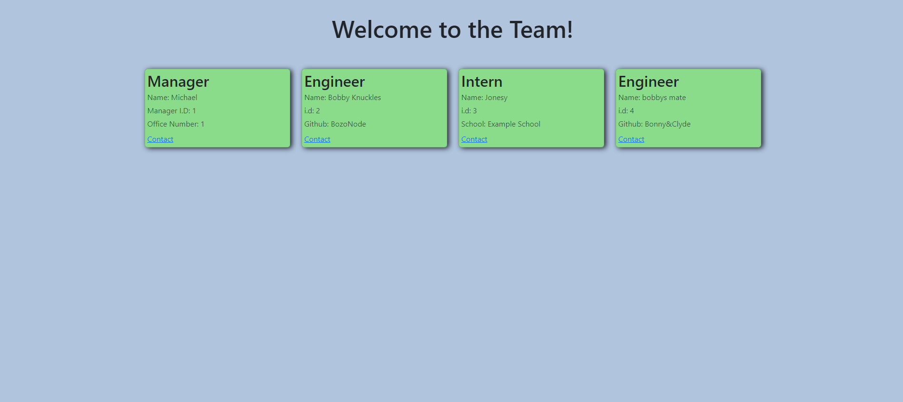

# Team Manager CLI Application <br>
[](https://opensource.org/licenses/MIT)

## Table of Contents

 - [About](#about)
 - [Description](#description)
 - [Future Development](#futuredevelopment)
 - [Installation](#installation)
 - [Tests](#tests)
 - [Usage](#usage)
 - [Contributers](#contributers)
 - [Contact](#contact)
 - [Licence](#licence)
 - [Demo](#demo)
 - [Screenshot](#screenshot)
***
## About

This project is designed and created to take in the users input through command line prompts and generate a webpages consisting of cards based on the users answers.
***
## Description
The Team Manager application prompts the user to answer questions relating to a Manager, Engineer and Intern, subsuquently creating cards with each members information aswell as clickable contact and github links for each user. 
The Technologies used for this project consist of;
<ul>
    <li>Node.js</li>
    <li>NPM</li>
    <li>Inquirer</li>
    <li>Bootstrap</li>
    <li>Javascript</li>
    <li>HTML</li>
    <li>CSS</li>
</ul>
***

## Future Development
This application in its current form has much more room to grow, potential future developments include but not limited to;
<ul>
<li>Team communication features</li>
<li>Current Project features</li>
<li>Project action board features</li>
</ul>

## Installation
To begin using this appilcation the user must first install dependencies as follows;
<ol>
<li>NPM install</li>
<li>NPM install inquirer@8.2.4</li>
</ol>
Once packages are installed to RUN the project open index.js file terminal and input node index.js.
***

## Tests
To run tests to make sure functions are running correctly, first open a terminal from index.js file, next run the command;
``` shell
npm run test
```
If all dependencies are installed, including Jest (Testing dependency) the tests will run and make sure subclass functions are working as intended. 
``` shell
Test Suites: 1 passed, 1 total
Tests:       3 passed, 3 total
Snapshots:   0 total
Time:        0.763 s, estimated 1 s
Ran all test suites.
```
***

## Usage
To begin using this application input the **node index.js** command, from there begin answers the given prompts relating to Manager, Intern and Engineer, note that only one Manager can be chosen. Continue to choose from Engineer and Intern team members until your team is built, once you have completed this select the 'Finish Building Team' prompt and your HTML page will be created, access this page on the left hand side of your screen (VS Code).
***
## Contributers

This project was created solely by<br>
Repository: [Zim40](https://github.com/Zim40/Team-Manager-CLI-Application)

## Contact
[Contact Us](mailto:michaelm810129@gmail.com)<br>
[GitHub](https://github.com/Zim40)
***
## Licence
This repository is covered under the MIT licence.
***
## Demo
[Demonstration video](https://drive.google.com/file/d/1Cx9ZIEn17IYvF4A7nuWVjm7Li8zRePFT/view)
***
## ScreenShot

